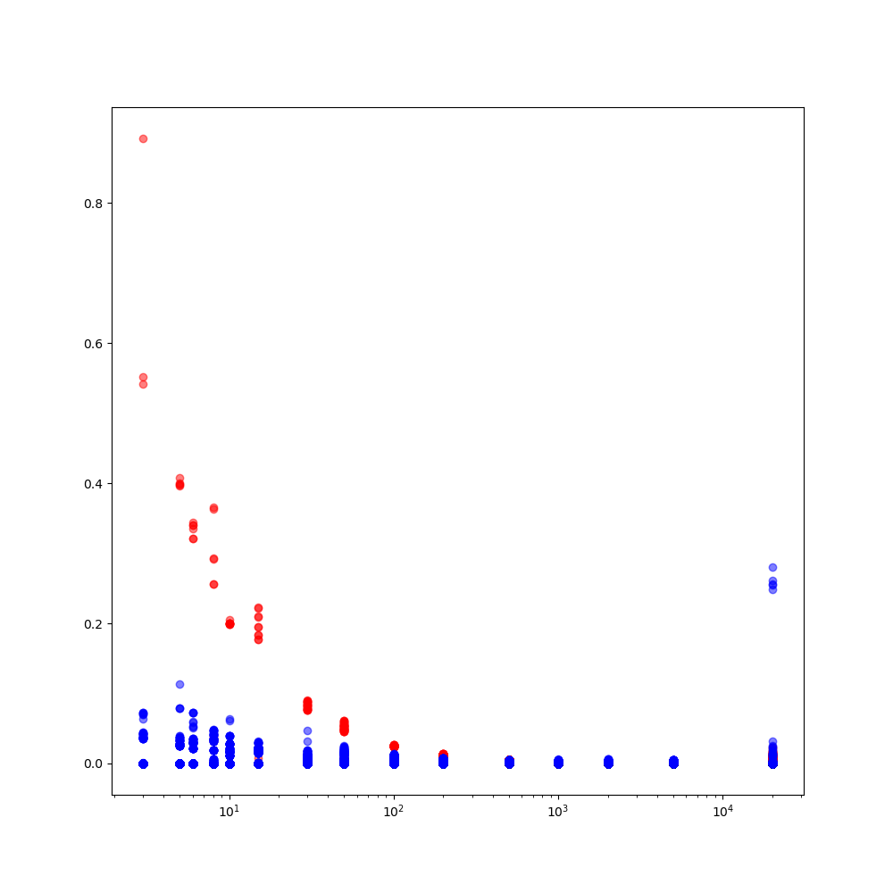
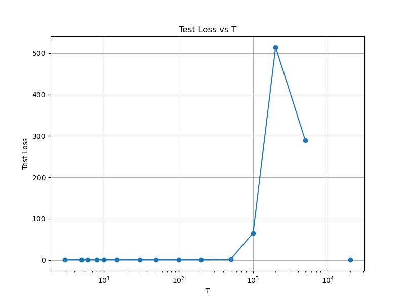

# Отчет по проекту Toy ReLU

## 1. Введение
### Описание задачи
В данном проекте исследуется феномен "double descent" в контексте обучения простых нейронных сетей с ReLU активацией. Основная цель - воспроизведение результатов, описанных в статье "Superposition, Memorization, and Double Descent" (https://transformer-circuits.pub/2023/toy-double-descent/index.html), где авторы пытаются объяснить явление переобучения, а также явление Double Descent, когда кривая обучения не монотонно убывает, а имеет еще один пик в середине (не всегда) обучения.

### Цели проекта
1. Реализация "игрушечных" ReLU моделей согласно статье
2. Воспроизведение графиков, демонстрирующих феномен double descent
3. Анализ полученных результатов и сравнение с оригинальной работой

## 2. Методология
### 2.1 Архитектура модели
- Нейросеть очень простая и состоит из матрицы весов W, которая инициализирована с xavier_uniform, вектора смещений b, инициализированного нулями, и ReLU активации. Архитектурно мы сначала сжимаем пространство из (T, n) в (T, m), где T - параметр, отвечающий за размер тренировочной выборки, n - количество фичей, m - размерность скрытого пространства. После разжимаем и получаем ту же размерность. На выходе используем ReLU активацию.

### 2.2 Процесс обучения
    Генерируем данные размера (T, n). Саму матрицу генерируем из равномерного распределения, затем с вероятностью 0.999 обнуляем значение. В конце нормируем векторы по колонкам. В процессе тренировки проходимся полным батчом, num_step=50000, weight_decay=1e-2, warmup_steps=2500. Также используем lr_decay.

### 2.3 Проблемы при обучении

Глобально ни с какими особыми проблемами, кроме стандартного дебаггинга кода я не столкнулся. Изначальные эксперименты показывали стабильно маленький лосс, одна из проблем была в том, что я нормализовывал без dim=0. После того, как поправил это и еще пару багов, графики стали похожими на правду. Еще есть проблема в том, что на графике есть разрывы, в этих местах loss NA, я так понял, что из-за переполнения в float.

## 3. Результаты

Самая важная картинка, так как заданием было повторить double descent эффект. Кажется, у меня это получилось, кстати, примерно как и у авторов статьи, у них тоже второй скачок был где-то в середине (middle regime). 

Куча картинок лежит в папке assets, там я визуализировал T-gons, которые получаются на разных T. Собственно, там тоже все ожидаемо, сначала у нас получаются T-gons, позже мы видим, что получается пентагон, то есть модель перестает просто запоминать тренировочные данные и начинает генерализовываться.

## 5. Список литературы
1. [Superposition, Memorization, and Double Descent](https://transformer-circuits.pub/2023/toy-double-descent/index.html)
2. [Toy Models of Superposition](https://transformer-circuits.pub/2022/toy_model/index.html) 